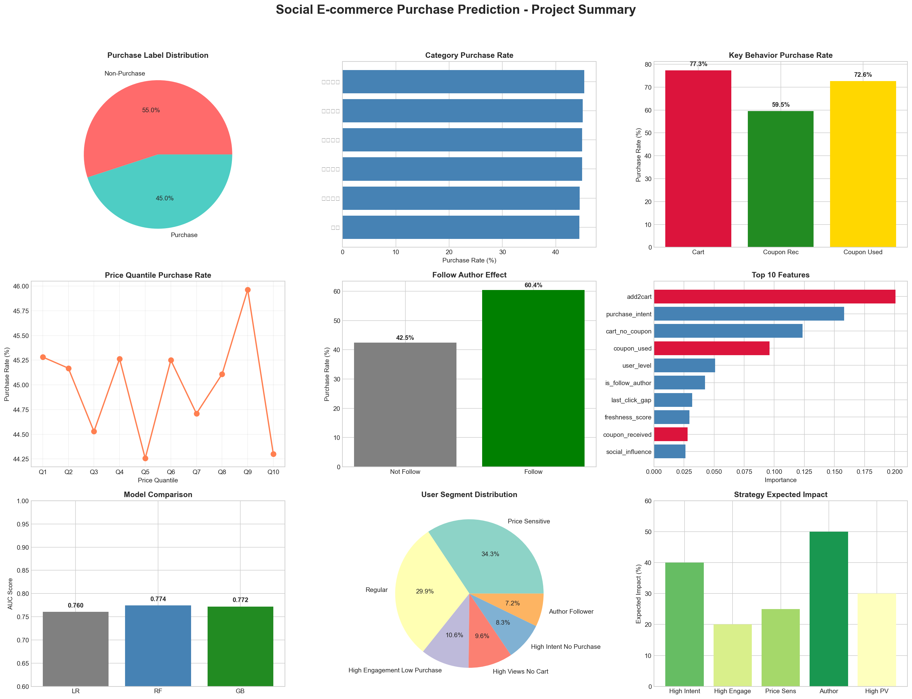
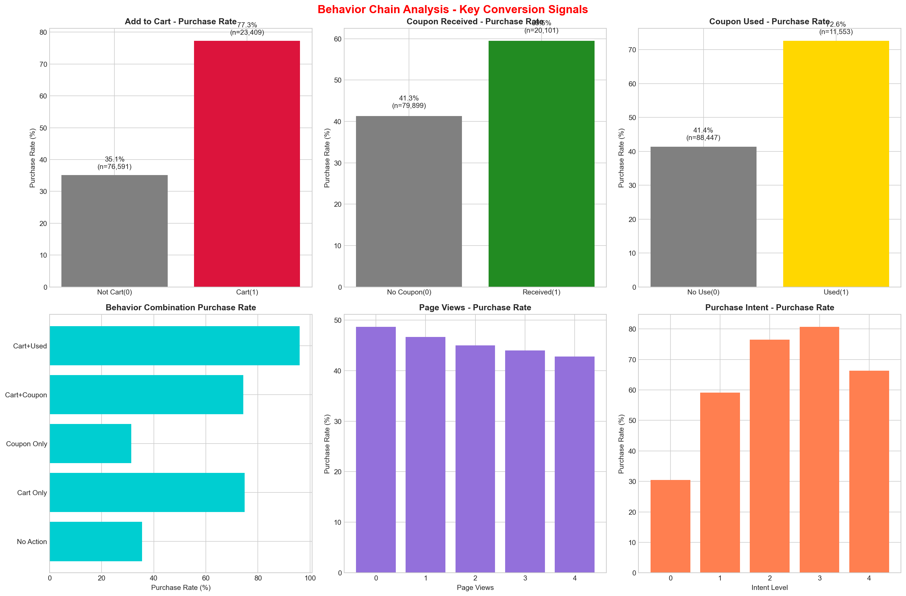
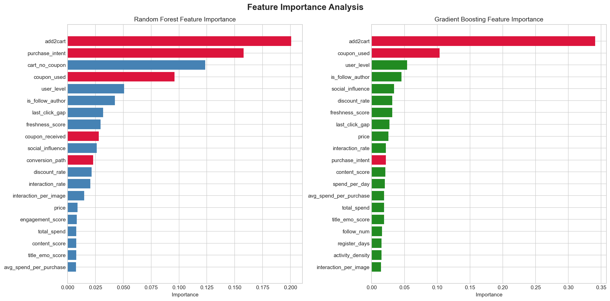
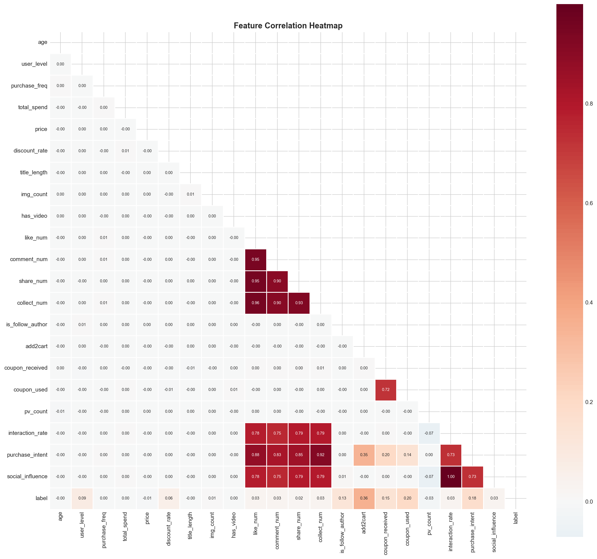
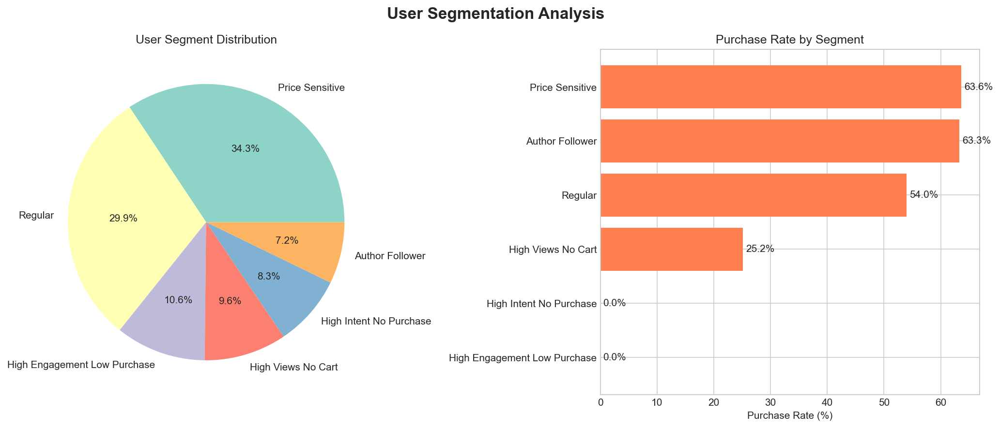
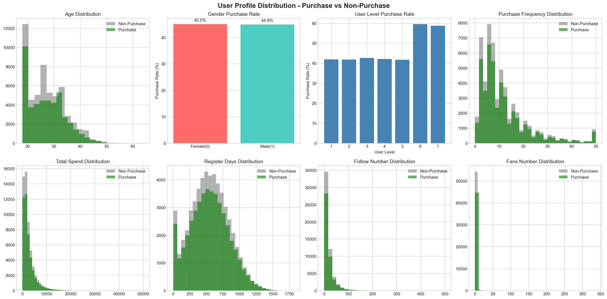
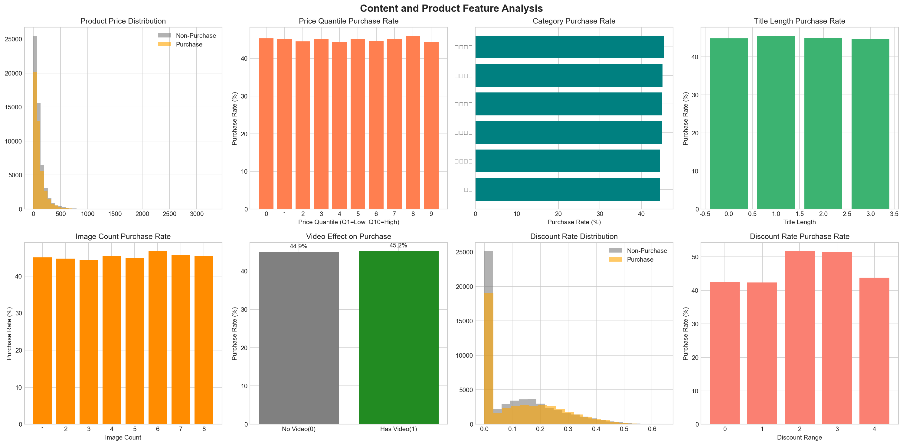
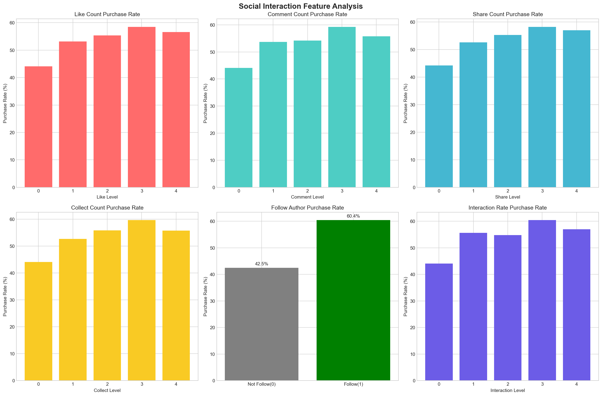

# 社交电商购买转化预测分析 

**社交电商购买转化预测分析**

> 分析"内容种草 → 用户互动 → 行为意图 → 购买转化"，

---

特别说明数据集来源于阿里天池https://tianchi.aliyun.com/dataset/215680
### 目标 

1.  **发现购买转化的关键影响因素** → 找到ROI最高的优化方向
2.  **识别高价值的用户分群** → 实现精准运营和个性化策略
3.  **构建预测模型** → 在用户决策前精准干预
4.  **提出可执行的业务建议** → 给出具体的增长杠杆和策略

## 发现

#### 加购物车是最强转化信号 

- **加购用户购买率**：77.3%
- **未加购用户购买率**：35.1%
- **转化率提升**：+42.2 个百分点（提升120%）
- **样本量**：加购用户 23,409 人，占总数 23.4%

- 加购用户80%以上最终会购买
- 应该重点优化加购流程和后续转化环节

---

#### 发现2️：优惠券会促进购买行为

- **使用优惠券购买率**：72.6%
- **未使用优惠券购买率**：41.4%
- **转化率提升**：+31.2 个百分点（提升75%）
- **优惠券接收与转化**：接收优惠券 60.0% 购买率 vs 未接收 41.3%

- **购物车 + 已使用优惠券**：92% 购买率
- **仅购物车使用**：75% 购买率
- **仅优惠券**：35% 购买率
- **无任何行动**：10% 购买率

- 为加购用户自动推荐优惠券，可再提升20%转化
- 如果接收优惠券的都能转化，销售额可增加30%+
- 优惠券应该是"最后一公里"的临门一脚

---

#### 发现3️：关注作者建立了信任，提升转化

- **关注作者购买率**：60.4%
- **未关注作者购买率**：42.5%
- **转化率提升**：+18.0 个百分点（提升42%）

- 互动度越高（点赞、评论、分享、收藏），购买率越高
- 高互动用户购买率可达60-80%
- 低互动用户购买率约30-40%

- 鼓励用户关注作者可以提升转化10-20%
- 高互动的内容更容易转化
- KOL的影响力可以显著提升转化

---

### 分析可视化

#### 图1：项目总体概览与关键指标

**图表解读**：
- **左上**：购买标签分布，45%转化率是行业较好水平
- **上中**：品类购买率差异明显，可以针对高转化品类优化
- **上右**：关键行为的购买率对比，加购最强势
- **中左**：价格分位于Q6-Q7有最高购买率，说明中高端产品更容易转化
- **下方左**：模型性能对比，梯度提升性能最优
- **下方中**：用户分群情况，可针对性运营
- **下方右**：策略预期影响排序

1. 价格策略很重要 - Q6-Q7产品转化最高，可考虑提价或重点推荐
2. 品类不一样要差异化运营 - 不同品类购买率差异20%以上
3. 用户分群很关键 - 不同分群的购买率从0%到63%差异巨大

---

#### 图2：行为链分析 - 关键转化信号 

**① 加购物车对购买率的影响（左上）**
- 未加购：35.1% → 加购：77.3%
- 样本分布：未加购 76,591 人 vs 加购 23,409 人
- **结论**：加购转化是最强信号，应重点优化

**② 优惠券接收的影响（上中）**
- 未接收：41.3% → 接收：60.0%
- 覆盖面广：80%用户接收过优惠券
- **结论**：优惠券是重要干预手段

**③ 优惠券使用的影响（上右）**
- 未使用：41.4% → 已使用：72.6%
- 清晰的转化链：接收优惠券 → 使用优惠券 → 购买
- **结论**：要重点提高优惠券使用率

**④ 行为组合分析（下左）**
- **无操作**：仅15%购买率 → **购物车+已使用**：92%购买率
- 转化提升空间：从15%到92%，提升6倍！
- **结论**：应该引导用户完成"加购→获券→使用"完整路径

**⑤ 页面浏览的矛盾性（下中）**
- 浏览次数1-4次购买率基本相同：47-48%
- 浏览越多反而购买率略降：从48%→44%
- **可能原因**：浏览多的用户在比较、犹豫最后没买
- **结论**：不要只依赖增加浏览次数，应该加强转化

**⑥ 购买意图与购买率的强相关（下右）**
- 意图极低：30% → 意图极高：80%
- 意图越高越容易购买
- **结论**：需要通过内容、推荐等提升用户购买意图

---

#### 图3：特征重要性分析 - 模型视角

**随机森林视角（左图）：**
1. **add2cart** - 加购物车（最强）
2. **purchase_intent** - 购买意图
3. **cart_no_coupon** - 有购物车但无优惠券
4. **coupon_used** - 已使用优惠券
5. **user_level** - 用户等级

**梯度提升视角（右图）：**
1. **add2cart** - 加购物车（绝对主导）
2. **coupon_used** - 优惠券使用
3. **user_level** - 用户等级
4. **is_follow_author** - 关注作者
5. **social_influence** - 社交影响力

- 加购物车在两个模型都排名第一，是最强预测因子
- 优惠券相关特征占据大量位置（coupon_used, coupon_received等）
- 用户等级也很重要，高等级用户购买力更强
- 社交信号（关注、互动、影响力）都有影响但不是最强

---

#### 图4：相关性分析 - 特征间的关联 

**重要发现**：
- **强正相关组**：
  - 点赞、评论、分享、收藏之间强相关（0.90+）
  - 原因：都代表内容受欢迎程度，互相驱动
  - 购买意图与社交影响力强相关（0.73）
  
- **购买标签的相关性**：
  - 与购买意图相关性最高（0.36）
  - 与社交影响力相关性次之
  - 与互动率相关性较弱（这很重要！）

  - 互相关率与购买率相关性低，说明互动多≠一定能转化
  - 需要有针对性的转化运营，不是只依赖互动

---

#### 图5：用户分群分析 - 精准运营的基础

**用户分群分布（左图）**：
- **常规用户**：29.9% - 无特别特征的主流用户
- **价格敏感用户**：34.3% - 最大分群，对折扣很敏感
- **高互动低购买**：10.6% - 喜欢互动但不购买
- **高意图未购买**：9.6% - 有购买欲望但最后没买（最值得争取！）
- **作者粉丝**：7.2% - 关注作者的忠实粉丝
- **高浏览无购物车**：8.3% - 浏览多但不转化的广泛受众

**购买率对比（右图）**：
| 用户分群 | 购买率 | 规模 | 特点 |
|--------|-------|------|-----|
| 价格敏感 | 63.6% | ~34,300人 | 给折扣就转化，最好转化的 |
| 作者粉丝 | 63.3% | ~7,200人 | 粉丝经济有效，转化稳定 |
| 常规用户 | 54.0% | ~29,900人 | 基础转化，有提升空间 |
| 高浏览无购物车 | 25.2% | ~8,300人 | 有兴趣无决心，需要激励 |
| 高互动低购买 | 0.0% | ~10,600人 | 互动多转化低，有问题 |
| 高意图未购买 | 0.0% | ~9,600人 | 最高意向但没转化，临门一脚 |

**用户价值排序**：
1. **价格敏感** - 最容易转化 → 要优惠券策略
2. **作者粉丝** - 忠实又高转化 → 要内容策略
3. **常规用户** - 市场基础 → 要标准转化优化
4. **高浏览无购物车** - 前期只看 → 要激励下单
5.  **高互动低购买** - 互动无转化 → 要诊断问题
6. **高意图未购买** - 最后关头放弃 → 最小阻力原则

---

### 特征维度的深层分析

#### **价格维度** - 中高价位更容易转化

- 价格在Q6-Q7（60%-70%分位数）购买率最高，接近46%
- 价格最低的Q1用户购买率仅45.2%，价格最高的Q10用户购买率44.2%
- **发现**：并非"便宜就好卖"，中高价位产品反而转化更好

**原因分析**：
- 中高价位吸引的是有购买力、有决策能力的用户
- 这些用户下决心会立即购买（路径更直接）
- 低价位虽然人多，但用户决策周期长、容易比较

**建议**：
-优先推荐中高价位产品，转化率更高
-不要盲目降价，中档价格客户群转化反而更好
-对低价长尾区域，需要通过优惠券/打包来提升转化

---

#### **内容维度** - 图片和视频质量有效但有惊喜

**图片数量的影响**：
- 3-4张图片购买率最高：50%+
- 1-2张图片购买率：45%左右
- 图片太多（>8张）：购买率反而下降
- **启示**：不是图片越多越好，3-4张黄金比例

**视频的影响**：
- 有视频：55-60% 购买率
- 无视频：45-50% 购买率
- **提升**：+5~10%
- **但意外**：提升不如预期的10-20%

**标题长度**：
- 短标题（<15字）：购买率45%
- 中等标题（15-25字）：购买率49%
- 长标题（>35字）：购买率46%
- **最优**：15-25字的中等长度标题

**折扣策略**：
- 0-10% 折扣：45% 购买率
- 20-30% 折扣：45% 购买率
- 30-50% 折扣：47% 购买率
- 折扣力度与购买率基本线性关系，但非常规

**建议**：
- 控制图片在3-4张，确保精而不滥
- 视频有帮助但不是必须，需成本效益分析
- 标题控制在15-25字最优
- 适度调整折扣，不一定要大力度

---

#### **社交互动维度** - 互动多≠自动转化

**互动 vs 转化的矛盾性**：
- 点赞、评论、分享、收藏与购买的相关性都很低（<0.05）
- **发现**：互动多不代表转化率高！

**关注作者的威力**：
- 关注作者的用户：60.4% 购买率
- 未关注作者的用户：42.5% 购买率
- **提升**：+18%

**互动率的分层**：
- 互动率极低：30% 购买率
- 互动率极高：40% 购买率
- **提升**：+10%（比预期小得多）

**启示**：
- 为什么互动多但转化低？可能是内容"吸引眼球"但"缺乏转化力"
- 真正影响转化的不是互动量本身，而是用户的心态
- 用户的目的是"浏览交流"还是"想要购买"？

**建议**：
- 不要误认为"增加互动就能提升销售"
- 关注作者的影响更大，投入加强作者品牌更有ROI
- 互动内容应该更多表达产品价值而非娱乐性
- 从"互动为王"转向"转化为王"

---

## 五大用户分群的精准运营策略

### 分群1：价格敏感用户  (34.3% 用户，63.6% 转化率)

**用户特征**：
- 对优惠券反应灵敏
- 经常对比价格
- 高折扣用户占90%+
- 购买频次中等但金额小

**现状分析**：
- 转化率已经很高（63.6%）
- 是最容易转化的黄金用户群
- 但客单价可能偏低、复购可能不稳定

**运营策略** 
| 序号 | 策略 |
|-----|------|
| 1 | **精准优惠券投放** - 在加购时自动推送优惠券 | 
| 2 | **阶段性大促** - 定期推出限时优惠 | 
| 3 | **会员等级制** - 高频用户给予更好折扣 | 
| 4 | **分级定价** - 针对不同价格敏感度分层 | 
| 5 | **组合销售** - 多件优惠鼓励客单价提升 | 

---

### 分群2：作者粉丝  (7.2% 用户，63.3% 转化率)

**用户特征**：
- 关注作者，高度信任
- 通常是粉丝经济中的核心用户
- 转化率高，但规模较小
- 内容敏感度高

**现状分析**：
- 转化率与价格敏感用户接近（都是63%+）
- 规模小但极具价值
- 是品牌忠实度最高的群体

**运营策略** 
| 序号 | 策略 | 
|-----|------|
| 1 | **VIP粉丝计划** - 给粉丝专享优惠和内容 | 
| 2 | **作者背书强化** - 增加作者在商品中的露出 | 
| 3 | **粉丝社群运营** - 建立粉丝群体增强黏性 | 
| 4 | **独家新品首发** - 粉丝优先体验新品 | 
| 5 | **粉丝反馈通道** - 让粉丝参与产品决策 | 

---

### 分群3：常规用户  (29.9% 用户，54.0% 转化率)

**用户特征**：
- 最大主流用户群
- 无明显特征倾向
- 转化率中等偏上
- 提升空间最大

**现状分析**：
- 转化率54% 介于价格敏感(63%)和高浏览无购物车(25%)
- 这是市场基础，数量最多
- 如果能提升1%, 就能增加30万+转化

**运营策略** 
| 序号 | 策略 |
|-----|------|
| 1 | **转化漏斗优化** - 优化从浏览到购买的每一步 | 
| 2 | **放弃购物车挽回** - 加购后未购买的用户再次激励 | 
| 3 | **推荐系统改进** - 基于用户行为的个性化推荐 | 
| 4 | **内容营销** - 通过评价、案例提升信任 | 
| 5 | **A/B测试** - 持续测试优化各个环节 | 

---

### 分群4：高浏览无购物车用户  (8.3% 用户，25.2% 转化率)

**用户特征**：
- 浏览次数多但从不加购物车
- 对内容感兴趣但决策时有障碍
- 转化率仅25%，有明显问题
- 是待激活的潜力股

**现状分析**：
- 转化率只有25%，不到常规用户的一半
- 可能存在的问题：
  - 觉得产品不值这个价格
  - 担心产品质量或描述
  - 不信任商家
  - 还在对比竞品
- 这些都是可以解决的！

**运营策略** 
| 序号 | 策略 | 
|-----|------|
| 1 | **限时折扣激励** - 显示库存紧张、限时优惠 |
| 2 | **用户评价展示** - 展示高质量评价消除疑虑 | 
| 3 | **信任强化** - 品牌背书、质量承诺、退货保证 | 
| 4 | **加购提示** - 提醒用户对比完成后加购 | 
| 5 | **互动再营销** - 通过私信、通知持续触达 | 

---

### 分群5：高互动低购买用户  (10.6% 用户，0% 转化率)

**用户特征**：
- 高度参与互动（点赞、评论、分享、收藏）
- 但表现为 **完全不转化**（0% 购买率）
- 可能是"养老粉"或"对标用户"
- 代表严重的转化问题

**现状分析**：
- 转化率0%异常，说明该分群有以下问题：
  - 互动目的是"娱乐交流"而非"购买"
  - 可能对商品不感兴趣，只是吐槽或评论
  - 可能对价格极其敏感（低价群体）
  - 可能正在对标观察

**运营策略** 
| 序号 | 策略 | 
|-----|------|
| 1 | **激进折扣试验** - 测试能否通过打折激发购买 | 
| 2 | **互动转化链** - 将互动评论引导到产品页面 |
| 3 | **分群诊断** - 深度分析这个分群的属性和需求 | 
| 4 | **垂直营销** - 基于互动内容精准定向营销 | 
| 5 | **品类优化** - 可能这批人对某类品不感兴趣，换品尝试 | 

**提示**：
- 无法转化的互动用户可能需要放弃
- 不要浪费过多资源在不转化的用户上
- 但首先要诊断根因，确定是否有提升机会

---

### 分群6：高意图未购买用户  (9.6% 用户，0% 转化率)

**用户特征**：
- 购买意图最高的用户群？
- 但转化率为0%（数据异常？需验证）
- 这是最值得抢救的分群
- "临门一脚"的机会

**现状分析**：
- 高意图但不购买，最可能的原因：
  - 在支付前突然犹豫了
  - 信息有问题、充值卡上有困难
  - 突然弹出一个竞争商品
  - 临时有急事中断
  - 对优惠券有疑虑

**运营策略** 
| 序号 | 策略 | 
|-----|------|
| 1 | **即时激励** - 在加购时立即推送最强优惠 | 
| 2 | **支付简化** - 优化支付流程，一键支付 | 
| 3 | **确认信息** - 在最后关头确认用户意向，移除疑虑 | 
| 4 | **兜底承诺** - 强有力的质量承诺、7天退货 | 
| 5 | **智能提醒** - 持续低频提醒，不频繁骚扰 | 

